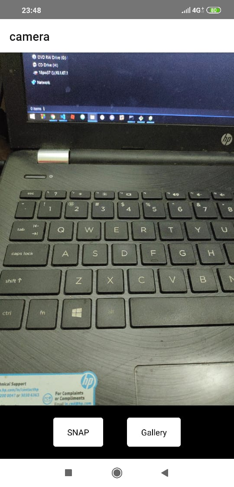
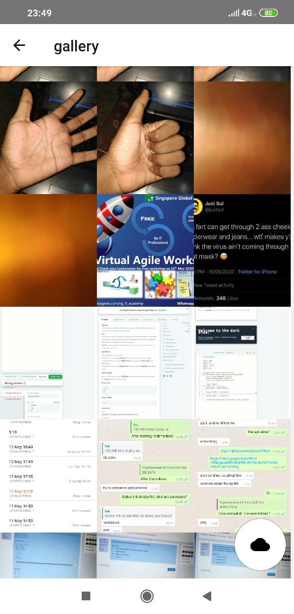

# Infilect
A Simple react-native android app to upload and sync your photos in google cloud
..
# Installation =>
run npm install or yarn install after cloning...
To Run on device use
 --> react-native run-android
 
 # Project Details =>
   /src/screen
             +camera.js
             +gallery.js
             +GalleryImage.js
             
         
           
 # Link For direct download Of APK
   https://drive.google.com/open?id=1Xi0kjN-eiMsAYXgnyK145cOqs0vGpPF3
   
 # App Functions
   The initial camera screen allows you to snap pictures, and saves them in your gallery. The App has an inbuilt gallery. The sync button in the gallery screen allows you to backup your photos in google cloud. (Only photos taken using the app will be uploaded). You can also select a particular pic and upload it seperately. Select a pic to see its status (synced or not). The uploading process resumes exactly when user closes and opens the app.
         
#### ScreenShots - Native App

